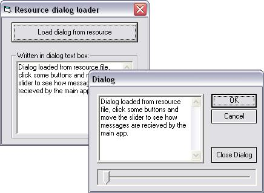



## Load Dialog from Resource

### Description

This code load's a dialog from a resouce file, it can also manipulate the controls on the dialog and recieve messages from it using subclassing. There is included one resource file containing a dialog with various controls, also one commoncontrol (slider) and some non-standard buttons.

Just made this for fun and a little experimenting with resource files, hope you like it.

BTW, you need Visual C++ if you want to add dialog's youself or change them. This because VB is only capable to see and compile the dialog resources, not to edit them.
 
### More Info
 

             |
---                |---
**Submitted On**   |2004-08-04 01:20:24
**By**             |[Peter Hebels](https://github.com/Planet-Source-Code/PSCIndex/blob/master/ByAuthor/peter-hebels.md)
**Level**          |Advanced
**User Rating**    |5.0 (15 globes from 3 users)
**Compatibility**  |VB 5\.0, VB 6\.0
**Category**       |[Miscellaneous](https://github.com/Planet-Source-Code/PSCIndex/blob/master/ByCategory/miscellaneous__1-1.md)
**World**          |[Visual Basic](https://github.com/Planet-Source-Code/PSCIndex/blob/master/ByWorld/visual-basic.md)
**Archive File**   |[Load\_Dialo177752842004\.zip](https://github.com/Planet-Source-Code/peter-hebels-load-dialog-from-resource__1-55341/archive/master.zip)

